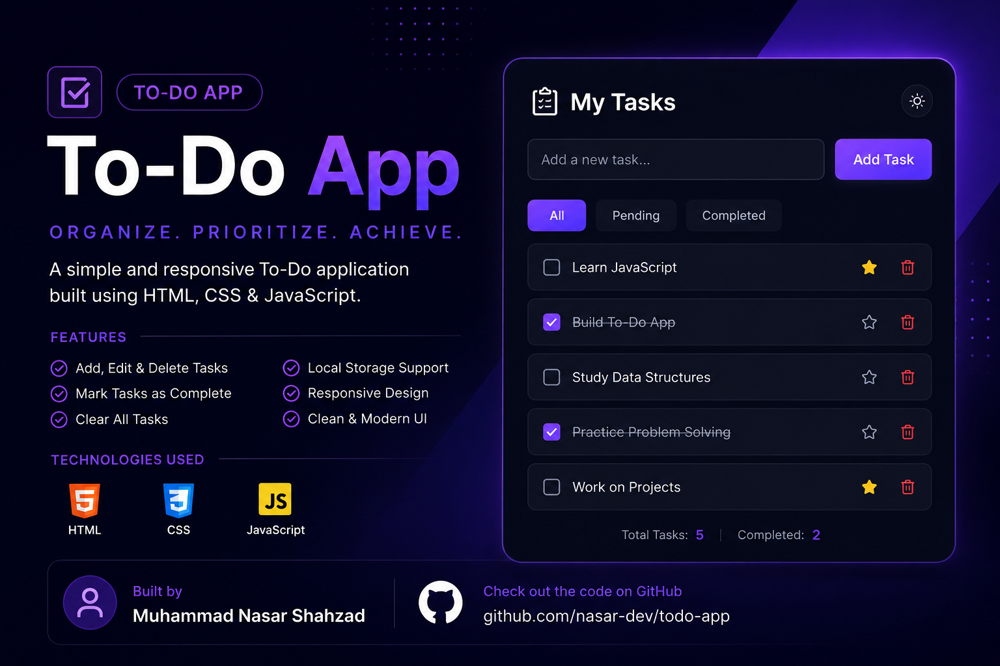

# 📝 To-Do App

A simple and clean To-Do application built using HTML, CSS, and JavaScript.

This app helps users manage daily tasks easily with data persistence using localStorage.

---

## 🚀 Features

- ➕ Add new tasks
- ❌ Delete tasks
- 💾 Data saved in browser (localStorage)
- 🔄 Data remains after refresh
- 📱 Simple and responsive UI

---

## 🛠️ Technologies Used

- HTML
- CSS
- JavaScript (Vanilla JS)
- localStorage API

---

## 🔗 Live Demo
https://nasar-dev.github.io/todo-app-with-localstorage/
